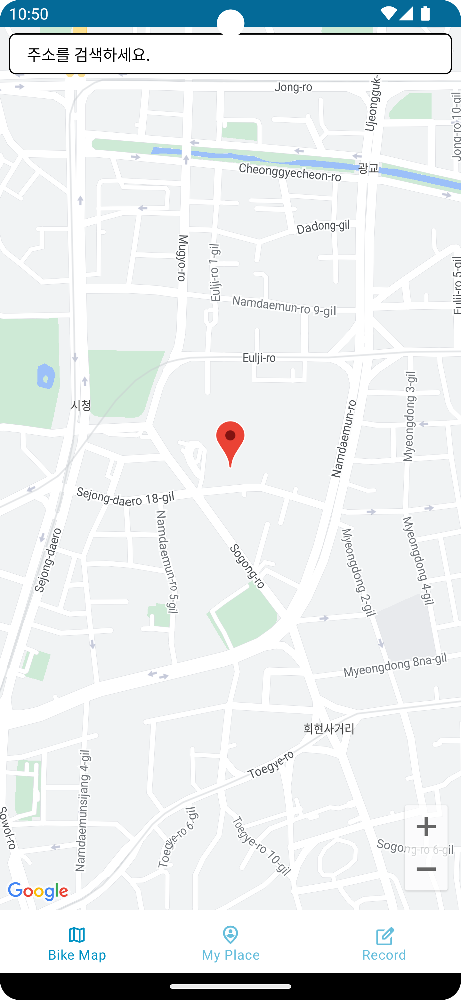
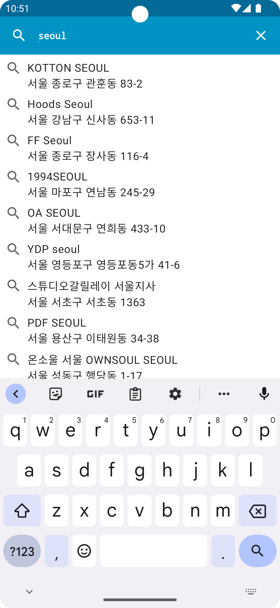
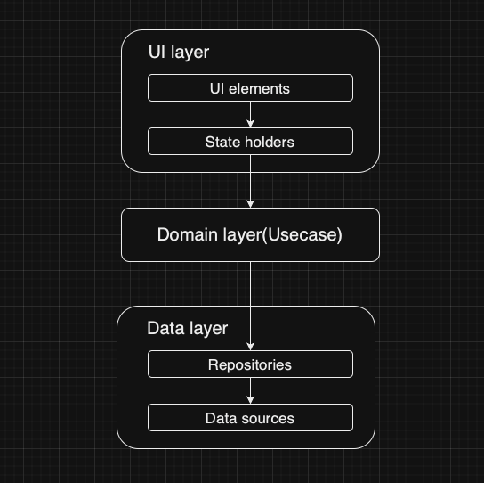

# K-자전거

  
  

 

원하는 위치를 지도에 표시할 수 있고 네비게이션을 통해 도착 예상 시간을 파악할 수 있다! 
주소 검색을 통해서 해당 위치 주변 시설 파악 가능! 
마커 클릭을 통해 해당 위치 정보 검색 가능! 
K-자전거 좋아요! 

 

[App Architecture] 

 

[라이브러리 목록] 
1. Jetpack Compose : UI 
2. Kotlin Coroutine : 비동기 
3. Kotlin Flow : Reactive Stream
4. Retrofit : 네트워크
6. Hilt : DI 라이브러리
7. Room : 로컬 데이터베이스

