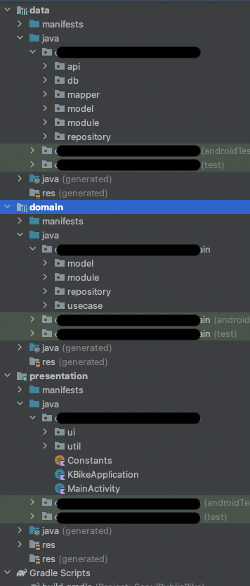
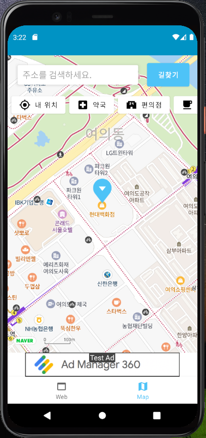

# Android 개발 스터디 목적 프로젝트 K-자전거

자전거인들을 위한 애플리케이션  

K-자전거는 자전거를 탈 때 고려해야 하는 여러 기능들을 지도 형태로 제공하는 서비스입니다.  
위치 서비스를 기반으로 주변 주요 시설 검색과 내비게이션 서비스를 이용할 수 있습니다. <r> 
  
개발인원 : 1명(개인 프로젝트)  
개발기간 : 2020.12 - 지속적이 리팩터링  
사용 API : Naver Api, Kakao Api  
기술 스택 :  
Kotlin, Clean Architecture, Android Jetpack, AAC(ViewModel, LiveData, Binding, Navigation), Room 
Kotlin Coroutine Flow, Room, Hilt, Jetpack Compose, Retrofit  
  
애플리케이션 코드 구조, 서비스 화면 

