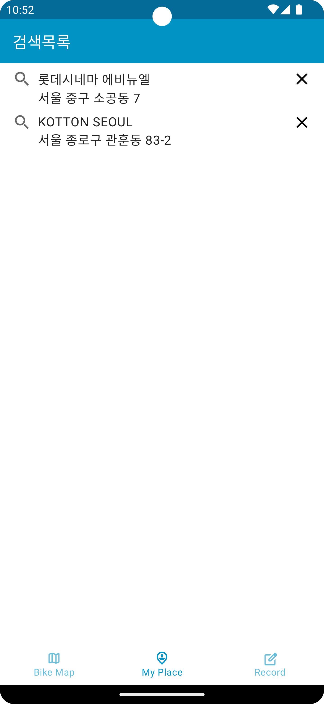

# Android 개발 스터디 목적 프로젝트 K-자전거
<h2>화면</h2>

 

  
  

 

[라이브러리 목록] 
1. Jetpack Compose : UI 
2. Kotlin Coroutine : 비동기 
3. Kotlin Flow : Reactive Stream
4. Retrofit : 네트워크
6. Hilt : DI 라이브러리
7. Room : 로컬 데이터베이스

